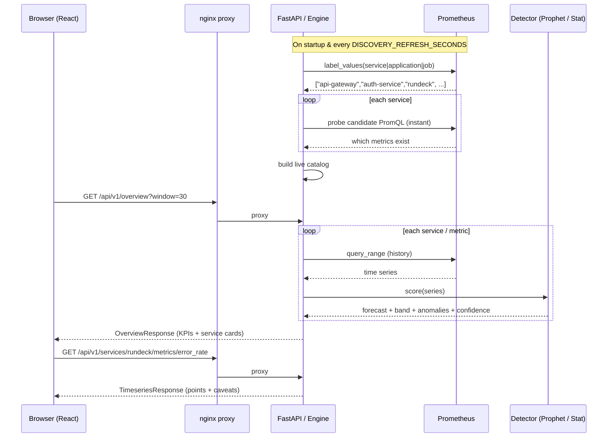

<div align="center">

# 🔮 Augur

### Predictive Anomaly Detection for Microservices

*An augur reads the signs to foretell what's coming. This one reads your metrics.*

**Prophet · Prometheus · FastAPI · React**

</div>

---

Augur connects to your **Prometheus** workspace, **auto-discovers** your services,
learns each metric's normal rhythm with **Facebook Prophet**, and surfaces
anomalies *before* they become incidents — with plain-English guidance on what
each chart means and what to do next.

Point it at Prometheus and the services show up on their own. Deploy a new
service called `rundeck`? It appears in the sidebar on the next discovery sweep,
no config, no redeploy.

> **No Prometheus handy?** Augur ships with a realistic demo dataset. Just run it.

---

## Table of contents

- [Highlights](#highlights)
- [Quick start (one command)](#quick-start-one-command)
- [Choosing your ports](#choosing-your-ports)
- [Connecting a live Prometheus](#connecting-a-live-prometheus)
- [Architecture](#architecture)
- [Request / discovery flow](#request--discovery-flow)
- [Data models](#data-models)
- [API reference](#api-reference)
- [Configuration reference](#configuration-reference)
- [How to read the charts (caveats)](#how-to-read-the-charts-caveats)
- [Local development](#local-development-without-docker)
- [Technology stack](#technology-stack)
- [Project layout](#project-layout)

---

## Highlights

| | |
|---|---|
| 🔌 **Plug-in Prometheus** | Set one URL. Augur discovers services from metric labels and probes which metric conventions each one exposes. |
| 🧠 **Smart, schema-agnostic discovery** | Works across Spring Boot/Micrometer, Node `prom-client`, and Go conventions by trying PromQL templates in order — first match wins. |
| 📈 **Prophet forecasting** | Per-service, per-metric models with a 99% prediction interval. Degrades gracefully to a robust statistical detector if Prophet's Stan backend is unavailable. |
| 🪄 **Dynamic UI** | The sidebar and dashboards are built from the live catalog. New service → new panel, automatically. |
| 🛟 **Three-layer graceful degradation** | Prometheus → demo data · Prophet → statistical detector · the system never hard-fails on a single dependency. |
| 🧾 **Honest caveats** | Every chart explains its band, its forecast line, and what's safe to ignore — so nobody misreads a data point. |
| ⚙️ **One config file each side** | `backend/config.py` and `frontend/src/config.js`. That's it. |
| 🐳 **One command to run** | `docker compose up --build`. |

---

## Quick start (one command)

> Prerequisites: **Docker** + **Docker Compose v2**.

```bash
git clone https://github.com/<your-org>/augur.git
cd augur
cp .env.example .env          # optional — sensible defaults work out of the box
docker compose up --build
```

Open **http://localhost:3100**.

That's the whole thing — backend, frontend, and reverse proxy, wired together.
With no `PROMETHEUS_URL` set, Augur starts in **demo mode** so you can explore
immediately. The API's interactive docs are at **http://localhost:8100/docs**.

To stop: `docker compose down`.

---

## Choosing your ports

Both ports live in the **root `.env`** — change them once, and the single
`docker compose up` honours them. **No code edits, no rebuilds of the frontend
bundle.**

```dotenv
# .env
FRONTEND_PORT=8080     # browse here
BACKEND_PORT=9090      # API + /docs here
```

```bash
docker compose up --build
# → UI at http://localhost:8080,  API at http://localhost:9090
```

**Why this just works:** the frontend never hardcodes the backend address. It
always calls the relative path `/api/v1/...`. In Docker, nginx proxies `/api`
to the backend container; in local dev, Vite does. So the backend port is a
pure deployment concern — exactly where it belongs.

---

## Connecting a live Prometheus

Edit `.env`:

```dotenv
DATA_MODE=live                                   # or "auto" to fall back to demo
PROMETHEUS_URL=http://prometheus.my-corp:9090
# Optional auth:
# PROMETHEUS_BEARER_TOKEN=ey...
# PROMETHEUS_USERNAME=ops
# PROMETHEUS_PASSWORD=secret
```

```bash
docker compose up --build
```

Augur will:
1. Query Prometheus for service names using the label candidates
   `service`, `application`, then `job` (configurable).
2. For each service, **probe** which logical metrics it exposes by running the
   candidate PromQL templates in [`backend/config.py`](backend/config.py).
3. Build a live catalog and render only the panels that have real data.
4. Re-scan every `DISCOVERY_REFRESH_SECONDS` so new services appear on their own.

**Teaching Augur a new metric convention** is a one-line change: add your PromQL
template to the relevant profile's `queries` list in `METRIC_PROFILES`. Nothing
else changes.

---

## Architecture

```
                         ┌──────────────────────────────────────────────┐
                         │                  Browser                       │
                         │     React SPA (Vite build, served by nginx)    │
                         │   Overview · Service detail · Anomalies         │
                         └───────────────────────┬────────────────────────┘
                                                 │  relative  /api/v1/*
                                                 ▼
                         ┌──────────────────────────────────────────────┐
                         │             nginx (frontend container)         │
                         │   • serves static SPA   • proxies /api → API   │
                         └───────────────────────┬────────────────────────┘
                                                 │  http://backend:${BACKEND_PORT}
                                                 ▼
   ┌────────────────────────────────────────────────────────────────────────────┐
   │                         FastAPI backend (Engine)                              │
   │                                                                              │
   │   api/routes.py ──► Engine ──┬─► PrometheusClient ──► (live)  Prometheus     │
   │                              │      discover • probe • range queries          │
   │                              │                                               │
   │                              ├─► synthetic.py ──────► (demo)  generated data │
   │                              │                                               │
   │                              └─► detector.py ───────► Prophet  ─┐            │
   │                                     make_detector()             ├─ scored    │
   │                                  StatisticalDetector (fallback) ─┘  series    │
   │                                                                              │
   │   model + series cache (TTL) · background re-discovery loop                  │
   └────────────────────────────────────────────────────────────────────────────┘
```

**Design principles**

- **Source-agnostic core.** The `Engine` doesn't know or care whether data came
  from Prometheus or the demo generator — both produce the same `(ts, value)`
  frames.
- **Detector-agnostic core.** Prophet and the statistical fallback implement the
  same scoring contract; the API reports which one served each series.
- **Config as data.** Metric definitions are PromQL *templates* in config, not
  hardcoded queries — this is what makes discovery portable across stacks.
- **Relative API path.** Ports and hosts are deployment config, never baked into
  the frontend.

---

## Request / discovery flow



---

## Data models

The Pydantic models in [`backend/app/models/schemas.py`](backend/app/models/schemas.py)
**are** the contract (rendered live at `/docs`). The essentials:

**`ServiceSummary`** — one card in the grid / sidebar entry
| field | type | meaning |
|---|---|---|
| `id` / `label` | string | service identifier / display name |
| `description` | string | what the service does |
| `tech` | string[] | inferred tech tags (cosmetic) |
| `worst_severity` | enum | `NORMAL` · `WATCH` · `WARNING` · `CRITICAL` |
| `metrics` | `MetricSnapshot[]` | current value + severity per metric |
| `available_metric_keys` | string[] | which metrics this service exposes |

**`TimeseriesResponse`** — the data behind a chart
| field | type | meaning |
|---|---|---|
| `service` | string | service id |
| `metric` | `MetricInfo` | key, label, unit, direction, description |
| `window_days` | int | analysis window |
| `resolution_seconds` | int | spacing between points |
| `model_trained` | bool | was a model actually fit |
| `detector` | string | `prophet` or `statistical` |
| `points` | `TimeseriesPoint[]` | observed, predicted, lower, upper, is_anomaly, severity, confidence |
| `caveats` | string[] | how to read *this* series |

**`Anomaly`** — one actionable finding
| field | type | meaning |
|---|---|---|
| `service` / `metric_key` | string | what deviated |
| `severity` | enum | graded from confidence |
| `direction` | enum | `spike` · `drop` |
| `observed` / `expected` | float | actual vs forecast |
| `confidence` | float | 0–1, higher = more normal |
| `recommended_action_label` | string | e.g. *Immediate action* |
| `recommended_steps` | string[] | concrete playbook steps |
| `caveat` | string | what might make this a false positive |

**Severity is graded from a confidence score**, *not* a hard threshold crossing.
`confidence = exp(-0.8 × residual)`, where `residual` is the distance from the
forecast measured in half-band widths (`residual = 1.0` sits exactly on the 99%
interval boundary). This lets `WATCH`/`WARNING` surface *before* a value crosses
the outer band — when a heads-up is still useful.

---

## API reference

Base path: **`/api/v1`** · Interactive docs: **`/docs`** · OpenAPI: **`/openapi.json`**

| Method | Path | Description |
|---|---|---|
| `GET` | `/health` | Liveness, active mode (live/demo), detector, services discovered |
| `GET` | `/config` | Bootstrap config for the UI (branding, windows, metric catalog) |
| `POST` | `/discover` | Force an immediate Prometheus re-scan |
| `GET` | `/overview?window=` | KPI roll-up + every service summary |
| `GET` | `/services?window=` | The dynamic service catalog (drives the sidebar) |
| `GET` | `/services/{service}/metrics/{metric}?window=` | Timeseries + forecast band + anomalies + caveats |
| `GET` | `/anomalies?window=&severity=` | Ranked, current anomalies with guidance |

```bash
# examples
curl http://localhost:8100/api/v1/health
curl "http://localhost:8100/api/v1/overview?window=30"
curl "http://localhost:8100/api/v1/services/payment-service/metrics/error_rate?window=7"
```

---

## Configuration reference

Two files, each the single source of truth for its side.

### Backend — [`backend/config.py`](backend/config.py)
Every field is overridable by an env var of the same name (see `backend/.env.example`).

| Setting | Default | Purpose |
|---|---|---|
| `data_mode` | `auto` | `auto` · `live` · `demo` |
| `prometheus_url` | `""` | Your Prometheus base URL |
| `prometheus_username` / `password` / `bearer_token` | `""` | Optional auth |
| `discovery_labels` | `["service","application","job"]` | Label candidates to find services |
| `discovery_include` / `exclude` | `[]` / `[prometheus,…]` | Allow/deny lists for the sidebar |
| `discovery_refresh_seconds` | `60` | Re-scan cadence (new services appear) |
| `rate_window` | `5m` | Window for `rate()` in PromQL templates |
| `prophet_enabled` | `true` | `false` → statistical detector only |
| `prophet_interval_width` | `0.99` | Confidence-band width |
| `model_cache_ttl_seconds` | `900` | Reuse a trained model before retraining |
| `severity_*_below` | `0.18 / 0.30 / 0.45` | Confidence thresholds for CRITICAL / WARNING / WATCH |
| `available_windows_days` | `[7,14,30,60,90]` | Window options shown in the UI |
| `METRIC_PROFILES` | *(see file)* | **The PromQL templates** — extend to support new stacks |

### Frontend — [`frontend/src/config.js`](frontend/src/config.js)

| Setting | Default | Purpose |
|---|---|---|
| `appName` / `tagline` | `Augur` / … | Branding shown in the header |
| `apiBaseUrl` | `/api/v1` | Relative — leave as-is unless cross-origin |
| `pollIntervalMs` | `30000` | Dashboard auto-refresh cadence |
| `defaultWindowDays` | `30` | Initial analysis window |
| `maxChartPoints` | `600` | Downsample target for snappy charts |
| `SEVERITY` / `CAVEATS` | *(see file)* | Status vocabulary & explanatory copy |

---

## How to read the charts (caveats)

A principal concern: a forecast chart is easy to **mis**read. Augur is explicit
about every element, both in the legend and in a *"Reading this chart"* panel
under each graph.

- **Solid line / shaded fill** — the **observed** metric.
- **Dashed grey line** — the **Prophet forecast** (what the model expected, given
  learned daily + weekly seasonality).
- **Faint band** — the **prediction interval** (default 99%). Inside = expected.
- **Coloured dots** — points the model flagged as **anomalies** (outside the band).
- **Confidence** — *how normal a value looks*, not a probability that something
  is broken. `100%` = right on the forecast; low = far outside the expected range.

> **The one rule that prevents 90% of false alarms:** a single isolated dot that
> immediately recovers is usually noise. Act on **sustained** deviations, not one
> scrape. Augur's "current status" deliberately reflects the worst severity over
> the **last ~30 minutes**, not a single point, for exactly this reason.

The detector also has no business context. A planned batch job, a marketing push,
or a deploy can all *look* anomalous while being perfectly fine — Augur says so on
every anomaly.

---

## Local development (without Docker)

**Backend**
```bash
cd backend
python -m venv .venv && source .venv/bin/activate      # Windows: .venv\Scripts\activate
pip install -r requirements.txt
cp .env.example .env                                    # optional
# IMPORTANT: run uvicorn via `python -m` so it uses THIS interpreter
# (and its Prophet install) — not a global one.
python -m uvicorn app.main:app --reload --port 8100
```

**Frontend**
```bash
cd frontend
npm install
cp .env.example .env                                    # set FRONTEND_PORT / BACKEND_PORT
npm run dev
# Vite serves the UI and proxies /api → http://localhost:${BACKEND_PORT}
```

> 💡 **Prophet install tip.** Prophet builds a Stan backend that can be slow or
> fiddly on some machines. If it fails to import, Augur automatically uses its
> statistical fallback detector — the app still runs, and `/health` reports
> `"prophet_available": false`. Set `PROPHET_ENABLED=false` to skip it entirely.

---

## Technology stack

| Layer | Tech |
|---|---|
| **Forecasting** | Facebook **Prophet** (+ robust statistical fallback) |
| **Backend** | **Python 3.11**, **FastAPI**, Pydantic v2, pandas, NumPy, httpx, loguru |
| **Metrics source** | **Prometheus** HTTP API (instant + range queries) |
| **Frontend** | **React 18**, **Vite 5**, **Recharts**, IBM Plex type system |
| **Serving / proxy** | **nginx** (static + `/api` reverse proxy) |
| **Orchestration** | **Docker** + **Docker Compose v2** |

---

## Project layout

```
augur/
├── docker-compose.yml          # one command runs the whole stack
├── .env.example                # ← set FRONTEND_PORT / BACKEND_PORT / PROMETHEUS_URL here
├── backend/
│   ├── config.py               # ★ the backend config file (all settings + PromQL templates)
│   ├── requirements.txt
│   ├── Dockerfile
│   ├── .env.example
│   └── app/
│       ├── main.py             # FastAPI app, lifespan, background discovery
│       ├── api/routes.py       # REST surface
│       ├── core/
│       │   ├── engine.py       # orchestrator (source- & detector-agnostic)
│       │   ├── prometheus.py   # live connector + smart discovery/probing
│       │   ├── detector.py     # Prophet + statistical fallback
│       │   └── synthetic.py    # demo data source
│       └── models/schemas.py   # Pydantic API contract
└── frontend/
    ├── Dockerfile              # multi-stage build → nginx
    ├── nginx.conf              # serves SPA + proxies /api
    ├── vite.config.js          # port + proxy from env
    ├── package.json
    └── src/
        ├── config.js           # ★ the frontend config file (branding, polling, copy)
        ├── theme.js            # design tokens
        ├── api/client.js       # API client
        ├── App.jsx             # views: overview · service detail · anomalies
        └── components/         # Header, Sidebar, ServiceCard, AnomalyChart, …
```

---

<div align="center">

Built to be read at 3 a.m. during an incident. Use the signs wisely. 🔮

</div>
